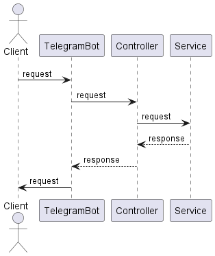

# Описание проекта Telegram-Bot

## UML - диаграмма

@startuml
actor Client as Client
Client -> TelegramBot: request
TelegramBot -> Controller: request
Controller -> Service: request
Service --> Controller : response
Controller --> TelegramBot: response
TelegramBot -> Client : request
@enduml

[]

